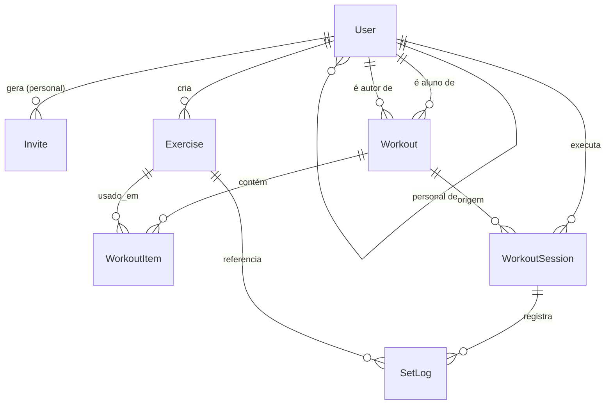

# Arquitetura do Repz

Documento de referência para backend e frontend. Os contratos detalhados de cada endpoint ficam no `plan.md` de cada funcionalidade em `docs/specs/`.

## 1. Visão geral

```
[ Next.js + Tailwind ]  --HTTP/JSON (JWT)-->  [ Express + TypeScript ]  --Prisma-->  [ PostgreSQL 16 (Docker) ]
      frontend/                                      backend/                              docker-compose.yml
```

- Monorepo: `backend/`, `frontend/`, `docs/`.
- Backend em camadas: `routes → controllers → services → prisma`.
- Autenticação por JWT no header `Authorization: Bearer <token>`.
- Swagger da API em `/api/docs` (OpenAPI 3).

## 2. Perfis

| Perfil | Pode |
|---|---|
| `PERSONAL` | Gerar convites, listar seus alunos, montar treinos para os alunos vinculados, ver histórico e evolução dos alunos vinculados, cadastrar exercícios próprios |
| `STUDENT` | Resgatar convite, visualizar treino do personal, executar treinos, ver o próprio histórico e evolução, cadastrar exercícios próprios. Sem personal: montar e editar os próprios treinos |

## 3. Regras de negócio consolidadas

Estas regras são a fonte única. As specs referenciam pelo código (RN-xx).

| Código | Regra |
|---|---|
| RN-01 | No cadastro, o usuário escolhe o perfil (`PERSONAL` ou `STUDENT`). O perfil não muda depois. |
| RN-02 | E-mail é único no sistema. Senha com no mínimo 8 caracteres, guardada como hash bcrypt. |
| RN-03 | Cada aluno tem no máximo um personal. O vínculo pertence ao aluno (`User.personalId`). |
| RN-04 | O vínculo é criado por **código de convite** gerado pelo personal. O código é de **uso único** e **expira em 7 dias**. |
| RN-05 | Aluno e personal podem encerrar o vínculo. O aluno pode trocar de personal resgatando outro convite (o vínculo anterior é encerrado automaticamente). |
| RN-06 | O histórico (sessões e séries) pertence ao aluno. Ao encerrar ou trocar o vínculo, o personal antigo **perde** o acesso ao histórico. O novo personal **vê todo** o histórico anterior. |
| RN-07 | Aluno **com** personal só visualiza o treino montado pelo personal. Não cria nem edita treinos. |
| RN-08 | Aluno **sem** personal cria, edita e arquiva os próprios treinos. |
| RN-09 | Ao se vincular a um personal, os treinos próprios do aluno ficam **arquivados** (somente leitura, histórico mantido). Ao encerrar o vínculo, voltam a ficar **editáveis**. |
| RN-10 | Treino é organizado por dia da semana. Cada item informa exercício, ordem, número de séries, repetições-alvo, descanso (opcional) e observação (opcional). |
| RN-11 | Exercícios globais (seed) são somente leitura. Exercícios criados por um usuário só podem ser editados ou removidos por ele. Exercício em uso em algum treino ou sessão não pode ser removido (409). |
| RN-12 | Exercício tem somente texto, com campo opcional de link do YouTube. O backend valida o link e devolve a URL de embed. |
| RN-13 | A execução do treino é série a série: o aluno informa carga (kg, aceita decimais, ex.: 7,5) e repetições, conclui a série e passa para a próxima. |
| RN-14 | Durante a execução, o sistema mostra "da última vez" para o exercício (carga × repetições da última sessão finalizada). |
| RN-15 | Recorde pessoal (PR): série cuja carga supera a maior carga já registrada pelo aluno naquele exercício. |
| RN-16 | Volume da sessão = soma de (carga × repetições) das séries. Volume por exercício, idem. |
| RN-17 | Frequência semanal = quantidade de sessões finalizadas por semana (semana começa na segunda), últimas 8 semanas. |
| RN-18 | O personal só acessa dados de alunos atualmente vinculados a ele. Acesso a outros recursos retorna 403 (ou 404 quando a existência não deve ser revelada). |

## 3.1 Dados da execução

- Sessão (`WorkoutSession`) pertence ao aluno e referencia o treino e o dia da semana executado.
- Série (`SetLog`) guarda `exerciseId` diretamente, para o histórico sobreviver a mudanças no treino.
- Treino com sessões registradas não pode ser apagado (DELETE retorna 409 `WORKOUT_HAS_SESSIONS`); nesse caso ele é arquivado.

## 4. Modelo de dados



### Entidades

**User**: `id`, `name`, `email` (único), `passwordHash`, `role` (`PERSONAL` | `STUDENT`), `personalId?` (auto-relação, só para STUDENT), `createdAt`.

**Invite**: `id`, `code` (único), `personalId`, `expiresAt`, `usedAt?`, `usedByStudentId?`, `createdAt`.

**Exercise**: `id`, `name`, `muscleGroup` (enum), `description?`, `videoUrl?`, `createdById?` (nulo = global/seed), `createdAt`.

**Workout**: `id`, `name`, `studentId`, `authorId`, `archivedAt?`, `createdAt`, `updatedAt`.

**WorkoutItem**: `id`, `workoutId`, `exerciseId`, `weekday` (`MONDAY`…`SUNDAY`), `order`, `sets`, `targetReps`, `restSeconds?`, `notes?`.

**WorkoutSession**: `id`, `studentId`, `workoutId`, `weekday`, `startedAt`, `finishedAt?`.

**SetLog**: `id`, `sessionId`, `workoutItemId?`, `exerciseId`, `setNumber`, `weightKg` (Decimal 6,2), `reps`, `completedAt`.

`muscleGroup`: `CHEST`, `BACK`, `SHOULDERS`, `BICEPS`, `TRICEPS`, `LEGS`, `GLUTES`, `CORE`, `CARDIO`, `OTHER`.

## 5. Visibilidade de treinos (derivada de RN-07, RN-08, RN-09)

Para um aluno, os treinos visíveis são os que têm `studentId = aluno` e `authorId = (personalId atual, ou o próprio aluno se não tiver personal)`. Treinos próprios com `archivedAt` preenchido aparecem na lista de arquivados, somente leitura.

## 6. Padrões da API

- Prefixo: `/api`.
- Erros: `{ "error": { "code": "STRING", "message": "texto em português" } }`.
- Códigos: 400 validação, 401 não autenticado, 403 sem permissão, 404 não encontrado, 409 conflito, 422 regra de negócio violada.
- Datas em ISO 8601 (UTC). Cargas como número decimal (kg).
- Listagens simples sem paginação no MVP, exceto histórico de sessões (`?limit=&offset=`).

## 7. Decisões de arquitetura (ADR resumido)

| Decisão | Motivo |
|---|---|
| Express + Prisma + Zod | Stack recomendada no enunciado, tipagem ponta a ponta |
| Convite em vez de busca | Não expõe lista pública de personals |
| Vínculo no aluno (`personalId`) | Regra RN-06: histórico acompanha o aluno |
| `SetLog.exerciseId` direto | Evolução independe de edições no treino |
| Monorepo | Uma única entrega, mais simples para a banca |
